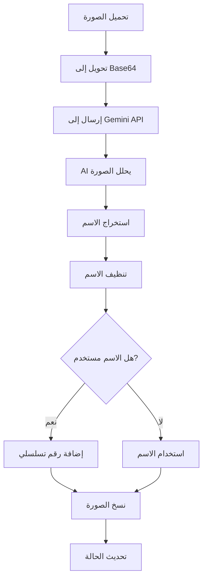

# ميزة إعادة تسمية الصور

## نظرة عامة

ميزة إعادة تسمية الصور تسمح لك بإعادة تسمية الصور تلقائياً بناءً على محتواها البصري أو النصي. تستخدم Google Gemini AI لتحليل كل صورة واستخراج المعلومات المناسبة لتوليد اسم ملف مناسب.

## متى تستخدم هذه الميزة؟

- 📝 إعادة تسمية صور الشاشات (Screenshots) بناءً على محتواها
- 🏷️ تنظيم صور المنتجات بناءً على أسمائها
- 📄 إعادة تسمية صور المستندات بناءً على النص الموجود فيها
- 🎯 أي حالة تحتاج فيها لإعادة تسمية صور بناءً على محتواها

## كيفية الاستخدام

### الخطوة 1: إعداد API Keys

1. افتح صفحة "إعادة تسمية الصور" من الصفحة الرئيسية
2. في قسم "إعدادات API"، أدخل مفاتيح Gemini API (مفتاح واحد في كل سطر)
3. المفاتيح سيتم حفظها تلقائياً

> 💡 **نصيحة**: يمكنك إضافة عدة مفاتيح لزيادة الحد اليومي. التطبيق سينتقل تلقائياً للمفتاح التالي إذا نفد حد المفتاح الحالي.

### الخطوة 2: اختيار المجلدات

1. **مجلد الصور**: اختر المجلد الذي يحتوي على الصور التي تريد إعادة تسميتها
   - اضغط "تصفح..." بجانب "مجلد الصور"
   - اختر المجلد المطلوب

2. **مجلد الإخراج**: اختر المجلد الذي تريد حفظ الصور المعاد تسميتها فيه
   - اضغط "تصفح..." بجانب "مجلد الإخراج"
   - اختر أو أنشئ مجلد جديد

> ⚠️ **ملاحظة**: الصور الأصلية لن يتم حذفها. سيتم نسخ الصور المعاد تسميتها إلى مجلد الإخراج.

### الخطوة 3: إضافة تعليمات مخصصة (اختياري)

في قسم "تعليمات AI مخصصة"، يمكنك إضافة تعليمات خاصة لتحسين عملية إعادة التسمية:

**أمثلة على التعليمات المخصصة**:
- `استخرج الاسم من النص الموجود أسفل الصورة`
- `استخدم العنوان الموجود في أعلى الصورة`
- `أعد التسمية بناءً على اسم التطبيق الظاهر في الصورة`
- `استخدم اسم اللعبة أو البرنامج كاسم الملف`

> 💡 **نصيحة**: التعليمات المخصصة تساعد AI على التركيز على جزء معين من الصورة.

### الخطوة 4: بدء إعادة التسمية

1. اضغط على زر "🚀 بدء إعادة التسمية"
2. راقب التقدم في قسم "الحالة"
3. ستظهر رسالة عند اكتمال العملية

## كيف تعمل الميزة تقنياً؟

### 1. تحميل الصور

عند اختيار مجلد الصور، يقوم التطبيق بـ:
- فحص جميع الملفات في المجلد
- تصفية الصور المدعومة (.jpg, .jpeg, .png, .webp)
- إضافة الصور إلى قائمة المعالجة

### 2. معالجة كل صورة

لكل صورة في القائمة:

1. **تحويل الصورة**: يتم تحويل الصورة إلى تنسيق Base64
2. **إرسال للـ AI**: يتم إرسال الصورة مع التعليمات المخصصة إلى Google Gemini API
3. **استخراج الاسم**: AI يحلل الصورة ويستخرج اسم مناسب



### 3. استخدام Google Gemini AI

التطبيق يستخدم **Gemini 2.0 Flash** مع prompt محدد:

```
Extract only the main title or name from this image. 
Return ONLY the title with no descriptions, explanations, or extra text. 
If there is readable text like a service name use it exactly. 
If no clear text exists, generate a short appropriate title. 
Return only the title.
```

إذا كانت هناك تعليمات مخصصة، يتم إضافتها للـ prompt.

### 4. تنظيف الاسم

بعد استخراج الاسم من AI، يتم تنظيفه:

- إزالة المسافات واستبدالها بـ `_`
- إزالة الأحرف الخاصة (ماعدا الحروف والأرقام و `_`)
- إزالة المسافات المتعددة
- قص المسافات من البداية والنهاية

**مثال**:
```
"صورة شاشة 2024!" → "صورة_شاشة_2024"
```

### 5. تجنب التعارض في الأسماء

- إذا كان الاسم مستخدماً في نفس الدفعة، يتم إضافة رقم تسلسلي: `اسم_1`, `اسم_2`, إلخ
- إذا كان الملف موجوداً في مجلد الإخراج، يتم إضافة رقم: `اسم_1`, `اسم_2`, إلخ

### 6. نسخ الصورة

- يتم نسخ الصورة الأصلية إلى مجلد الإخراج
- يتم استخدام الاسم الجديد
- الصورة الأصلية تبقى في مكانها

## حالات الحالة

| الحالة | الوصف |
|--------|-------|
| **في الانتظار** | الصورة في قائمة الانتظار للمعالجة |
| **جاري إعادة التسمية...** | الصورة قيد التحليل بواسطة AI |
| **تم** | تم إعادة تسمية الصورة ونسخها بنجاح |
| **خطأ** | حدث خطأ أثناء المعالجة |

## أمثلة عملية

### مثال 1: إعادة تسمية صور الشاشات

**قبل**:
```
Screenshot 2025-11-30 165715.png
Screenshot 2025-12-01 120000.png
Screenshot 2025-12-02 150000.png
```

**بعد** (مع تعليمات: "استخدم اسم التطبيق الظاهر"):
```
Google_Chrome.png
Visual_Studio_Code.png
Discord.png
```

### مثال 2: إعادة تسمية صور المنتجات

**قبل**:
```
IMG_001.jpg
IMG_002.jpg
IMG_003.jpg
```

**بعد** (مع تعليمات: "استخدم اسم المنتج"):
```
iPhone_15_Pro.png
MacBook_Pro_M3.png
AirPods_Pro.png
```

### مثال 3: إعادة تسمية صور المستندات

**قبل**:
```
photo1.png
photo2.png
photo3.png
```

**بعد** (مع تعليمات: "استخدم العنوان الموجود في الصورة"):
```
فاتورة_رقم_12345.png
عقد_إيجار_شقة.png
شهادة_تخرج.png
```

## نصائح للحصول على أفضل النتائج

### 1. استخدام تعليمات مخصصة

✅ **جيد**: `استخرج الاسم من النص الموجود أسفل الصورة`
❌ **سيء**: ترك الحقل فارغاً (قد يعطي نتائج عامة)

### 2. تحديد الجزء المطلوب

✅ **جيد**: `استخدم العنوان الموجود في أعلى الصورة`
❌ **سيء**: `استخرج النص` (غير محدد)

### 3. استخدام مفاتيح API متعددة

- أضف عدة مفاتيح API لزيادة الحد اليومي
- التطبيق سينتقل تلقائياً للمفتاح التالي عند نفاد الحد

### 4. مراجعة النتائج

- راجع الأسماء المولدة قبل النسخ
- يمكنك تعديل التعليمات وإعادة المحاولة إذا لزم الأمر

## الحدود والقيود

- **حد API**: كل مفتاح API له حد يومي. استخدم مفاتيح متعددة لتجاوز هذا الحد
- **الصيغ المدعومة**: فقط `.jpg`, `.jpeg`, `.png`, `.webp`
- **الدقة**: دقة الأسماء تعتمد على وضوح الصورة وجودة النص الموجود فيها
- **اللغة**: AI يدعم العربية والإنجليزية بشكل جيد

## استكشاف الأخطاء

### المشكلة: الأسماء المولدة غير دقيقة

**الحلول**:
- أضف تعليمات مخصصة أكثر تفصيلاً
- تأكد من أن الصور واضحة وذات جودة جيدة
- إذا كانت الصورة تحتوي على نص، تأكد من أن النص واضح

### المشكلة: بعض الصور لم تُعاد تسميتها

**الحلول**:
- تحقق من أن الصور بصيغ مدعومة
- تأكد من أن مفاتيح API لديها حد استخدام متبقي
- راجع رسائل الخطأ في عمود "الحالة"

### المشكلة: أسماء مكررة

**الحلول**:
- التطبيق يتعامل مع هذا تلقائياً بإضافة أرقام تسلسلية
- إذا رأيت أسماء مكررة، قد تكون هناك مشكلة في المعالجة

### المشكلة: العملية بطيئة جداً

**الحلول**:
- استخدم مفاتيح API متعددة لتسريع العملية
- قلل عدد الصور في المجلد
- تحقق من سرعة الاتصال بالإنترنت

## الفرق بين ميزة البحث وإعادة التسمية

| الميزة | البحث عن الصور | إعادة تسمية الصور |
|--------|----------------|-------------------|
| **الغرض** | العثور على صور تحتوي على محتوى معين | إعادة تسمية جميع الصور |
| **المدخلات** | وصف البحث | تعليمات مخصصة (اختياري) |
| **المخرجات** | صور مطابقة فقط | جميع الصور بأسماء جديدة |
| **الاستخدام** | للبحث والفلترة | للتنظيم وإعادة التسمية |

---

**العودة إلى**: [الصفحة الرئيسية](README.md) | [ميزة البحث](IMAGE_SEARCH.md)


