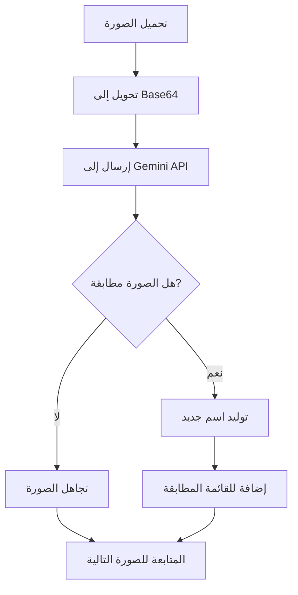

# ميزة البحث عن الصور

## نظرة عامة

ميزة البحث عن الصور تسمح لك بالعثور على صور تحتوي على محتوى معين باستخدام وصف نصي. تستخدم هذه الميزة Google Gemini AI لتحليل كل صورة وتحديد ما إذا كانت تطابق الوصف المطلوب.

## متى تستخدم هذه الميزة؟

- 🔍 البحث عن صور تحتوي على معلومات حساسة (بريد إلكتروني، كلمة مرور)
- 🚗 العثور على صور لسيارات أو كائنات بمواصفات معينة
- 📝 البحث عن صور تحتوي على نص معين
- 🎯 أي محتوى بصري يمكن وصفه بالكلمات

## كيفية الاستخدام

### الخطوة 1: إعداد API Keys

1. افتح صفحة "البحث عن الصور" من الصفحة الرئيسية
2. في قسم "إعدادات API"، أدخل مفاتيح Gemini API (مفتاح واحد في كل سطر)
3. المفاتيح سيتم حفظها تلقائياً

> 💡 **نصيحة**: يمكنك إضافة عدة مفاتيح لزيادة الحد اليومي. التطبيق سينتقل تلقائياً للمفتاح التالي إذا نفد حد المفتاح الحالي.

### الخطوة 2: إدخال وصف البحث

في قسم "وصف البحث"، اكتب وصفاً واضحاً لما تبحث عنه. أمثلة:

- `صورة تحتوي على بريد إلكتروني أو كلمة مرور`
- `سيارة حمراء`
- `صورة تحتوي على نص يشبه "ناقو" أو "الناقو"`
- `صورة لشاشة كمبيوتر تعرض جدول بيانات`

> 💡 **نصيحة**: كلما كان الوصف أكثر تفصيلاً، كانت النتائج أدق.

### الخطوة 3: اختيار المجلدات

1. **مجلد الصور**: اختر المجلد الذي يحتوي على الصور التي تريد البحث فيها
   - اضغط "تصفح..." بجانب "مجلد الصور"
   - اختر المجلد المطلوب

2. **مجلد الإخراج**: اختر المجلد الذي تريد نسخ الصور المطابقة إليه
   - اضغط "تصفح..." بجانب "مجلد الإخراج"
   - اختر أو أنشئ مجلد جديد

### الخطوة 4: بدء البحث

1. اضغط على زر "🔍 بدء البحث"
2. راقب التقدم في قسم "الحالة"
3. ستظهر رسالة عند اكتمال البحث

## كيف تعمل الميزة تقنياً؟

### 1. تحميل الصور

عند اختيار مجلد الصور، يقوم التطبيق بـ:
- فحص جميع الملفات في المجلد
- تصفية الصور المدعومة (.jpg, .jpeg, .png, .webp)
- إضافة الصور إلى قائمة المعالجة

### 2. معالجة كل صورة

لكل صورة في القائمة:

1. **تحويل الصورة**: يتم تحويل الصورة إلى تنسيق Base64
2. **إرسال للـ AI**: يتم إرسال الصورة مع وصف البحث إلى Google Gemini API
3. **تحليل النتيجة**: AI يحلل الصورة ويقرر ما إذا كانت مطابقة



### 3. استخدام Google Gemini AI

التطبيق يستخدم **Gemini 2.0 Flash** مع prompt مخصص:

```
Analyze this image and determine if it contains or shows: [وصف البحث]

Respond with JSON:
{
  "isMatch": true/false,
  "suggestedName": "appropriate filename",
  "reason": "brief explanation"
}
```

### 4. تصنيف النتائج

- **مطابق** ✅: الصورة تحتوي على المحتوى المطلوب
  - يتم توليد اسم مناسب من AI
  - يتم إضافتها للقائمة المطابقة
  - يتم تحديدها تلقائياً للنسخ

- **غير مطابق** ❌: الصورة لا تحتوي على المحتوى المطلوب
  - يتم إلغاء تحديدها تلقائياً
  - لا يتم إضافتها للنسخ

### 5. إعادة تسمية الصور المطابقة

عندما تكون الصورة مطابقة:
- إذا كان AI قد اقترح اسماً، يتم استخدامه
- إذا لم يكن هناك اقتراح، يتم توليد اسم جديد بناءً على محتوى الصورة
- يتم تنظيف الاسم (إزالة الأحرف الخاصة)
- يتم تجنب التعارض في الأسماء بإضافة أرقام تسلسلية

## نسخ الصور المطابقة

بعد اكتمال البحث:

1. **مراجعة النتائج**: راجع الصور المطابقة في الجدول
2. **تحديد الصور**: استخدم عمود "نسخ" لتحديد الصور التي تريد نسخها
   - ✓ لتحديد صورة
   - ☐ لإلغاء تحديد صورة
3. **النسخ**: اضغط على زر "📋 نسخ الصور المحددة"
4. **النتيجة**: ستجد الصور المنسوخة في مجلد الإخراج بأسماء جديدة

### تفاصيل النسخ

- يتم نسخ الصور إلى المجلد المحدد
- يتم إعادة تسميتها بالأسماء المولدة من AI
- إذا كان الملف موجوداً، يتم إضافة رقم تسلسلي
- يتم تحديث الحالة إلى "تم النسخ" بعد النسخ الناجح

## حالات الحالة

| الحالة | الوصف |
|--------|-------|
| **في الانتظار** | الصورة في قائمة الانتظار للمعالجة |
| **جاري المعالجة...** | الصورة قيد التحليل بواسطة AI |
| **مطابق** | الصورة تطابق الوصف المطلوب |
| **غير مطابق** | الصورة لا تطابق الوصف |
| **خطأ** | حدث خطأ أثناء المعالجة |
| **تم النسخ** | تم نسخ الصورة بنجاح |

## نصائح للحصول على أفضل النتائج

### 1. وصف واضح ومفصل

✅ **جيد**: `صورة تحتوي على بريد إلكتروني أو عنوان بريد إلكتروني`
❌ **سيء**: `بريد`

### 2. استخدام كلمات مفتاحية

✅ **جيد**: `سيارة حمراء كبيرة`
❌ **سيء**: `شيء أحمر`

### 3. تحديد السياق

✅ **جيد**: `صورة لشاشة كمبيوتر تعرض جدول بيانات Excel`
❌ **سيء**: `جدول`

### 4. استخدام مفاتيح API متعددة

- أضف عدة مفاتيح API لزيادة الحد اليومي
- التطبيق سينتقل تلقائياً للمفتاح التالي عند نفاد الحد

## الحدود والقيود

- **حد API**: كل مفتاح API له حد يومي. استخدم مفاتيح متعددة لتجاوز هذا الحد
- **الصيغ المدعومة**: فقط `.jpg`, `.jpeg`, `.png`, `.webp`
- **حجم الصور**: الصور الكبيرة جداً قد تستغرق وقتاً أطول في المعالجة
- **الدقة**: دقة النتائج تعتمد على جودة الوصف ووضوح الصور

## استكشاف الأخطاء

### المشكلة: لا توجد صور مطابقة

**الحلول**:
- جرب وصفاً أكثر تفصيلاً
- تأكد من أن الصور تحتوي فعلاً على المحتوى المطلوب
- تحقق من أن الصور بصيغ مدعومة

### المشكلة: البحث بطيء جداً

**الحلول**:
- استخدم مفاتيح API متعددة لتسريع العملية
- قلل عدد الصور في المجلد
- تحقق من سرعة الاتصال بالإنترنت

### المشكلة: نتائج غير دقيقة

**الحلول**:
- استخدم وصفاً أكثر تحديداً
- أضف تفاصيل إضافية في الوصف
- تأكد من أن الصور واضحة وذات جودة جيدة

---

**العودة إلى**: [الصفحة الرئيسية](README.md) | [ميزة إعادة التسمية](IMAGE_RENAME.md)


